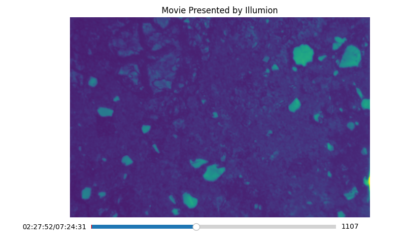
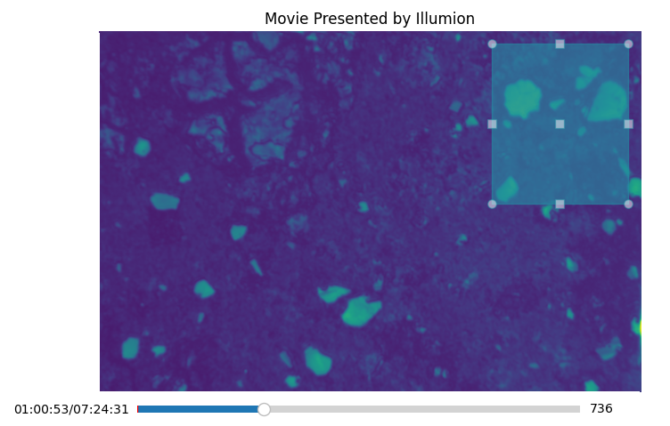
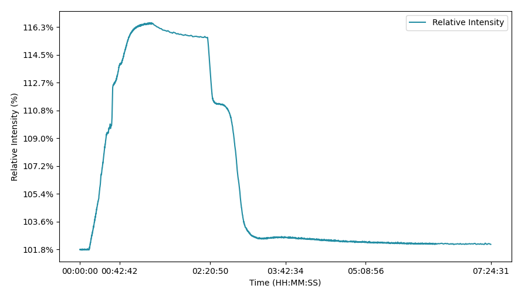

# Illumion task

## Installation & Execution

Create a Virtual Environment

```bash
virtualenv venv
source venv/bin/activate

# Alternatives
python -n venv venv
```

Install required libraries: matplotlib, numpy, PyQt5 (OPTIONAL)

```bash
pip install -r requirements.txt
```

Run the application
```bash
python3 main.py
```

## Result





## Limitations

- The mean intensity calculation may become slow for large datasets, especially when selecting larger rectangles. Although batch processing with NumPy improves performance, there are still potential delays when interacting with large images or multiple frames.
- The current interface may not handle complex interactions effectively. For instance, if a user selects multiple rectangles in quick succession, it may cause performance issues or UI lag.
- The application currently allows users to draw only one rectangle selection at a time. However, to facilitate the comparison of different relative intensities, it need to visualize all previously drawn rectangles on the user interface. This enables users to see the context of previous selections while making new ones.
- The rectangle edge color is randomly generated each time a rectangle is selected, but there is no mechanism for users to choose or customize colors. This may lead to a lack of control over the visual presentation.
- There is a slight delay when changing frames in the application. This could due to the way data is fetched from disk (Memory Mapping), or the matplotlib need time to redraw the frame.


## Assumptions Made

- It is assumed that the input files (movie.npy and time.npy) are correctly formatted and contain valid data. The code does not include checks for file integrity, data type or mismatch in number of entries between two input files.

## Design Choices

### Object-Oriented Design

The application is structured using object-oriented programming principles. The Movie class encapsulates all related functionality, promoting modularity and easier maintenance.

### Utils file
- A seperate utils.py file promotes modular design, allowing the main application logic to remain focused while utility functions handle repetitive tasks. The implementation includes a helper method to format time in HH:MM:SS, improving readability and usability for the user when interpreting the time axis.
- Organize codebase, improve code reusability, simplify testing and debugging.
